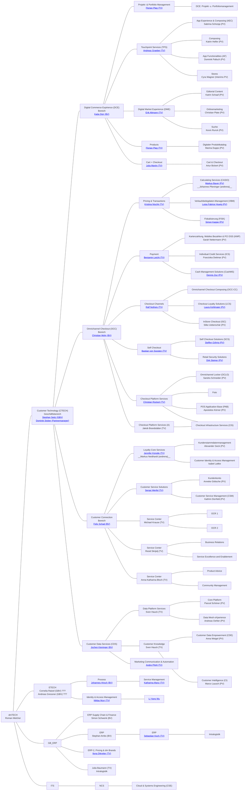

```mermaid
flowchart LR
    %%{init: {"flowchart": {"wrappingWidth": 700}}}%%

dmTECH["
dmTECH
Roman Melcher
"]

    CTECH["
    Customer Technology (CTECH) 
    Geschäftsbereich
    <a href='https://andrenaobjectsag.pipedrive.com/person/2845' target='_blank'>Stephan Seitz (GBV)</a>
    <a href='https://andrenaobjectsag.pipedrive.com/person/3600' target='_blank'>Dominik Stober (Partnermanager)</a>
    "]

        DCE["
        Digital Commerce Expirience (DCE)
        Bereich
        <a href='https://andrenaobjectsag.pipedrive.com/person/4918' target='_blank'>Katja Dürr (BV)</a>
        "]

            PPM["
            Projekt- & Portfolio Management
            <a href='https://andrenaobjectsag.pipedrive.com/person/4917' target='_blank'>Florian Plag (TV)</a>
            "]

                PPM-DCE["
                DCE: Projekt- u. Portfoliomanagement
                "]

            TPS["
            Touchpoint Services (TPS)
            <a href='https://andrenaobjectsag.pipedrive.com/person/3741' target='_blank'>Andreas Graeber (TV)</a>
            "]

                AEC["
                App Experience & Composing (AEC)
                Sabrina Schorpp (PV)
                "]

                Composing["
                Composing
                Katrin Helfer (PV)
                "]

                AF["
                App Functionalities (AF)
                Dominik Palluch (PV)
                "]

                Stores["
                Stores
                Cyra Wagner (Interims PV)
                "]

            DME["
            Digital Market Experience (DME)
            <a href='https://andrenaobjectsag.pipedrive.com/person/2226' target='_blank'>Erik Altmann (TV)</a>
            "]

                EditorialContent["
                Editorial Content
                Katrin Schaaf (PV)
                "]

                Onlinemarketing["
                Onlinemarketing
                Christian Plate (PV)
                "]

                Suche["
                Suche
                Kevin Runck (PV)
                "]

            Products["
            Products
            <a href='https://andrenaobjectsag.pipedrive.com/person/4917' target='_blank'>Florian Plag (TV)</a>
            "]

                DigitalerProduktkatalog["
                Digitaler Produktkatalog
                Marina Dupps (PV)
                "]

            TeamCartCheckout["
            Cart + Checkout
            <a href='https://andrenaobjectsag.pipedrive.com/person/4919' target='_blank'>Julia Martin (TV)</a>
            "]

                CartCheckout["
                Cart & Checkout
                Artur Bickert (PV)
                "]


        OCC["
        Omnichannel Checkout (OCC)
        Bereich
        <a href='https://andrenaobjectsag.pipedrive.com/person/2667' target='_blank'>Christian Mohr (BV)</a>
        "]

            PricingTransactions["
            Pricing & Transactions
            <a href='https://andrenaobjectsag.pipedrive.com/person/3431' target='_blank'>Kristina Nischk (TV)</a>
            "]

                CASIO["
                Calculating Services (CASIO)
                <a href='https://andrenaobjectsag.pipedrive.com/person/3447' target='_blank'>Markus Bayer (PV)</a>
                __Johannes Plieninger (andrena)__
                "]

                VBM["
                Verkaufsbelegdaten-Management (VBM)
                <a href='https://andrenaobjectsag.pipedrive.com/person/3330' target='_blank'>Luisa Fabrice Huwig (PV)</a>
                "]

                FISK["
                Fiskalisierung (FISK)
                <a href='https://andrenaobjectsag.pipedrive.com/person/4910' target='_blank'>Simon Kappe (PV)</a>
                "]

            Payment["
            Payment
            <a href='https://andrenaobjectsag.pipedrive.com/person/4911' target='_blank'>Benjamin Leicht (TV)</a>
            "]

                KMP["
                Kartenzahlung, Mobiles Bezahlen & PCI DSS (KMP)
                Sarah Nettermann (PV)
                "]

                ICS["
                Individual Credit Services (ICS)
                Franziska Dettmar (PV)
                "]

                CashMS["
                Cash Management Solutions (CashMS)
                <a href='https://andrenaobjectsag.pipedrive.com/person/4912' target='_blank'>Dennis Zoz (PV)</a>
                "]

            CheckoutChannels["
            Checkout Channels
            <a href='https://andrenaobjectsag.pipedrive.com/person/4911' target='_blank'>Ralf Notheis (TV)</a>
            "]
                OCC-CC["
                Omnichannel Checkout Composing (OCC-CC)
                "]

                CLS["
                Checkout Loyalty Solutions (LCS)
                <a href='https://andrenaobjectsag.pipedrive.com/person/4914' target='_blank'>Laura Kohlmaier (PV)</a>
                "]

                ISC["
                InStore Checkout (ISC)
                Silke Ueberschär (PV)
                "]

            SelfCheckout["
            Self Checkout
            <a href='https://andrenaobjectsag.pipedrive.com/person/3667' target='_blank'>Bastian von Soosten (TV)</a>
            "]

                SCS["
                Self Checkout Solutions (SCS)
                <a href='https://andrenaobjectsag.pipedrive.com/person/4915' target='_blank'>Steffen Göhrig (PV)</a>
                "]

                RSS["
                Retail Security Solutions
                <a href='https://andrenaobjectsag.pipedrive.com/person/4916' target='_blank'>Dirk Steiner (PV)</a>
                "]

            CheckoutPlatformServices["
            Checkout Platform Services
            <a href='https://andrenaobjectsag.pipedrive.com/person/2758' target='_blank'>Christian Rückert (TV)</a>
            "]

                OCLO["
                Omnichannel Locker (OCLO)
                Sandra Schneider (PV)
                "]

                Foto["
                Foto
                "]

                PAB["
                POS Application Base (PAB)
                Apostolos Körner (PV)
                "]

            CheckoutPlatformServicesAustria["
            Checkout Platform Services (A)
            Jakob Brandstätter (TV)
            "]

                CIS["
                Checkout Infrastructure Services (CIS)
                "]
        
        CustomerConnection["
        Customer Connection
        Bereich
        <a href='https://andrenaobjectsag.pipedrive.com/person/3318' target='_blank'>Felix Schad (BV)</a>
        "]

            LCS["
            Loyalty Core Services
            <a href='https://andrenaobjectsag.pipedrive.com/person/3746' target='_blank'>Jennifer Künstle (TV)</a>
            __Markus Neidhardt (andrena)__
            "]

                Kundenstammdatenmanagement["
                Kundenstammdatenmanagement
                Alexander Geck (PV)
                "]

                CIAM["
                Customer Identity & Access Management
                Isabel Lattke
                "]

            CSS["
            Customer Service Solutions
            <a href='https://andrenaobjectsag.pipedrive.com/person/4519' target='_blank'>Sergej Werfel (TV)</a>
            "]

                Kundenkonto["
                Kundenkonto
                Anneke Göttsche (PV)
                "]

                CSM["
                Customer Service Management (CSM)
                Kathrin Dürrfeld (PV)
                "]

            ServiceCenterA["
            Service Center
            Michael Krause (TV)
            "]

                OCR1["
                OCR 1
                "]

                OCR2["
                OCR 2
                "]

            ServiceCenterB["
            Service Center
            Resid Skrijelj (TV)
            "]

                BusinessRelations["
                Business Relations
                "]

                SEE["
                Service Excellence and Enablement
                "]

            ServiceCenterC["
            Service Center
            Anna-Katharina Bloch (TV)
            "]

                ProductAdvice["
                Product Advice
                "]

                CommunityManagement["
                Community Management
                "]

        CDS["
        Customer Data Services (CDS)
        <a href='https://andrenaobjectsag.pipedrive.com/person/3971' target='_blank'>Jochen Kieninger (BV)</a>
        "]

            DataPlatformServices["
            Data Platform Services
            Sven Hauck (TV)
            "]
                CorePlatform["
                Core Platform
                Pascal Schöner (PV)
                "]

                DataMesheXperience["
                Data Mesh eXperience
                Andreas Oehler (PV)
                "]

            CustomerKnowledge["
            Customer Knowledge
            Sven Hauck (TV)
            "]
                CDE["
                Customer Data Empowerment (CDE)
                Anna Weigel (PV)
                "]

                CI["
                Customer Intelligence (CI)
                Marco Lausch (PV)
                "]

            MarketingCommunicationAutomation["
            Marketing Communication & Automation
            <a href='https://andrenaobjectsag.pipedrive.com/person/4922' target='_blank'>Andre Pfohl (TV)</a>
            "]        

    ETECH["
    ETECH
    Cornelia Ratzel (GBV) ???
    Andreas Gressner (GBV) ???
    "]

        Process["
        Process
        <a href='https://andrenaobjectsag.pipedrive.com/person/3860' target='_blank'>Johannes Hirsch (BV)</a>
        "]

            ServiceManagement["
            Service Management
            <a href='https://andrenaobjectsag.pipedrive.com/person/4065' target='_blank'>Katharina Manz (TV)</a>
            "]

        ERP_SC_F["
        ERP Supply Chain & Finance
        Simon Schwenk (BV)
        "]

        ERP_B["
        ERP
        Stephan Ambs (BV)
        "]

        ERP["
        ERP
        <a href='https://andrenaobjectsag.pipedrive.com/person/3773'>Sebastian Koch (TV)</a>
        "]

            Intralogistik["
            Intralogistik
            "]

        ERP-2["
        ERP-2, Pricing & dm Brands
        <a href='https://andrenaobjectsag.pipedrive.com/person/4045' target='_blank'>Ilona Dikreiter (TV)</a>
        "]

        T_IL["
        Julia Baumann (TV)
        Intralogistik
        "]

        IAM["
        Identity & Access Management
        <a href='https://andrenaobjectsag.pipedrive.com/person/3984' target='_blank'>Niklas Murr (TV)</a>
        "]

            IAM_NN["
            <a href='https://andrenaobjectsag.pipedrive.com/person/4921' target='_blank'>Li Yang Wu</a>
            "]


dmTECH --- CTECH
    CTECH --- DCE
        DCE --- PPM
            PPM --- PPM-DCE
        DCE --- TPS
            TPS --- AEC
            TPS --- Composing
            TPS --- AF
            TPS --- Stores
        DCE --- DME
            DME --- EditorialContent
            DME --- Onlinemarketing
            DME --- Suche
        DCE --- Products
            Products --- DigitalerProduktkatalog
        DCE --- TeamCartCheckout
            TeamCartCheckout --- CartCheckout
    CTECH --- OCC
        OCC --- PricingTransactions
            PricingTransactions --- CASIO
            PricingTransactions --- VBM
            PricingTransactions --- FISK
        OCC --- Payment
            Payment --- KMP
            Payment --- ICS
            Payment --- CashMS
        OCC --- CheckoutChannels
            CheckoutChannels --- OCC-CC
            CheckoutChannels --- CLS
            CheckoutChannels --- ISC
        OCC --- SelfCheckout
            SelfCheckout --- SCS
            SelfCheckout --- RSS
        OCC --- CheckoutPlatformServices
            CheckoutPlatformServices --- OCLO
            CheckoutPlatformServices --- Foto
            CheckoutPlatformServices --- PAB
            CheckoutPlatformServices --- CIS
        OCC --- CheckoutPlatformServicesAustria
            CheckoutPlatformServicesAustria --- CIS
    CTECH --- CustomerConnection
        CustomerConnection --- LCS
            LCS --- Kundenstammdatenmanagement
            LCS --- CIAM
        CustomerConnection --- CSS
            CSS --- Kundenkonto
            CSS ---CSM
        CustomerConnection --- ServiceCenterA
            ServiceCenterA --- OCR1
            ServiceCenterA --- OCR2
        CustomerConnection --- ServiceCenterB
            ServiceCenterB --- BusinessRelations
            ServiceCenterB --- SEE
        CustomerConnection --- ServiceCenterC
            ServiceCenterC --- ProductAdvice
            ServiceCenterC --- CommunityManagement
    CTECH --- CDS
        CDS --- DataPlatformServices
            DataPlatformServices --- CorePlatform
            DataPlatformServices --- DataMesheXperience
        CDS --- CustomerKnowledge
            CustomerKnowledge --- CDE
            CustomerKnowledge --- CI
        CDS --- MarketingCommunicationAutomation
dmTECH --- ETECH
    ETECH --- Process
        Process --- ServiceManagement
    ETECH --- IAM
        IAM --- IAM_NN
dmTECH --- GB_ERP
    GB_ERP --- ERP_SC_F
    GB_ERP --- ERP_B
        ERP_B ---ERP
            ERP --- Intralogistik
    GB_ERP --- ERP-2
    GB_ERP --- T_IL
dmTECH --- GB_ITS["ITS"]
    GB_ITS --- NCS["NCS"]
    NCS ---CSE["Cloud & Systems Engineering (CSE)"]


    
```